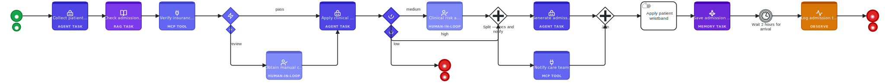

# Example: Patient Preadmission

A reference APMN workflow for a private hospital preadmission process. Demonstrates every major APMN node type in a realistic end-to-end scenario.

**Download:** [patient_preadmission.apmn.yaml](https://raw.githubusercontent.com/kshetra-studio/apmn/main/examples/patient_preadmission.apmn.yaml)

## What it covers

| Node type | Where used |
|---|---|
| `agentTask` | Collect demographics, apply clinical criteria, generate documents |
| `ragTask` | Retrieve admission policy from vector store |
| `mcpToolTask` | Verify insurance coverage, notify care team |
| `mcpGate` | HIPAA / Privacy Act compliance check |
| `confidenceGate` | Route on AI admission decision confidence |
| `humanInLoopTask` | Manual consent, clinical risk assessment |
| `parallelGateway` | Generate docs + notify care team simultaneously |
| `memoryTask` | Save patient admission context for future agent calls |
| `timerEvent` | Wait 2 hours for patient arrival |
| `observeEvent` | Log trace to Langfuse |
| `escapeGate` | Safety net for failures or low-confidence results |
| `manualTask` | Apply ID wristband (physical, human only) |

## Workflow

Screenshot from the [APMN Modeler](https://apmn-modeler.kshetra.studio):



*(Diagram shows the start of the flow — open the file in the [APMN Modeler](https://apmn-modeler.kshetra.studio) to explore the full confidence-gated branching, parallel split, and end states.)*

## APMN Source

```yaml
--8<-- "examples/patient_preadmission.apmn.yaml"
```
